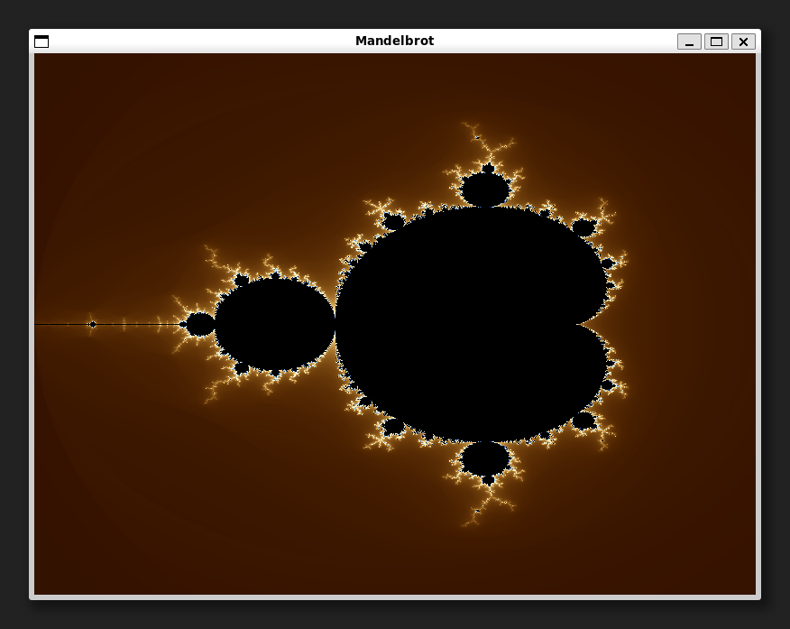
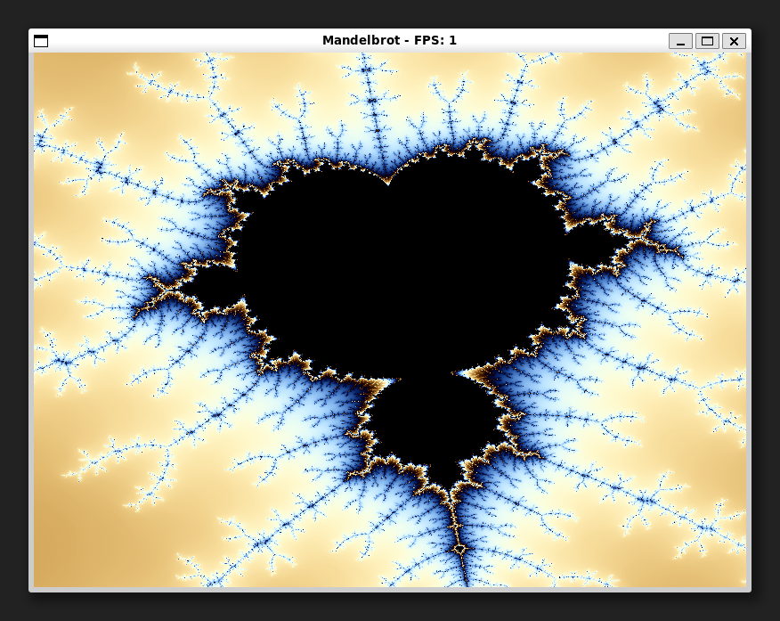

# Visualizador del Conjunto de Mandelbrot

Este proyecto es un visualizador interactivo del **Conjunto de Mandelbrot** desarrollado en lenguaje **C** utilizando la biblioteca **SDL2** para el renderizado y **OpenMP** para el procesamiento paralelo.

Fue desarrollado como parte de la asignatura de **Graficación por Computadora**.

<p align="center">
  
</p>

## Características

- **Renderizado en Tiempo Real:** Optimizado mediante multihilos con OpenMP.
- **Interacción Dinámica:** Zoom centrado en la posición del mouse.
- **Visualización de Rendimiento:** Contador de FPS integrado en la ventana.
- **Navegación Fluida:** Exploración del fractal con controles de teclado.

<p align="center">
  <br>
  <i><small>*La calidad visual de este GIF está reducida debido a las limitaciones de tamaño del formato. Su propósito es únicamente ilustrar el programa en ejecución.*</small></i>
</p>

## Requisitos

Para compilar y ejecutar este proyecto, necesitarás:

- **GCC** (u otro compilador de C con soporte para C11).
- **SDL2** (Simple DirectMedia Layer 2).
- **OpenMP** (para la aceleración por multihilos).

### Instalación de dependencias (Linux/Ubuntu)

```bash
sudo apt-get update
sudo apt-get install libsdl2-dev
```

## Compilación y Ejecución

El proyecto incluye un `Makefile` para facilitar la gestión del binario.

1. **Compilar:**
   ```bash
   make
   ```

2. **Ejecutar:**
   ```bash
   ./mandelbrot
   ```

3. **Limpiar archivos temporales:**
   ```bash
   make clean
   ```

## Controles

| Tecla | Acción |
|-------|--------|
| `+` / `Pad +` | Aumentar Zoom (centrado en el mouse) |
| `-` / `Pad -` | Disminuir Zoom (centrado en el mouse) |
| `R` | Resetear vista a la posición inicial |
| `ESC` | Salir de la aplicación |

## Galería

| Detalle del Fractal | Vista General |
|:---:|:---:|
|  |  |

## Detalles Técnicos

- **Mandelbrot Logic:** Implementado en `mandelbrot.c`, calcula la iteración de escape para cada punto.
- **Rendering Engine:** `render.c` gestiona el mapeo de coordenadas del viewport a píxeles y utiliza `fopenmp` para distribuir la carga de trabajo entre los núcleos del procesador.
- **Input Handling:** `main.c` gestiona el bucle de eventos de SDL2 para una respuesta inmediata a los comandos del usuario.
